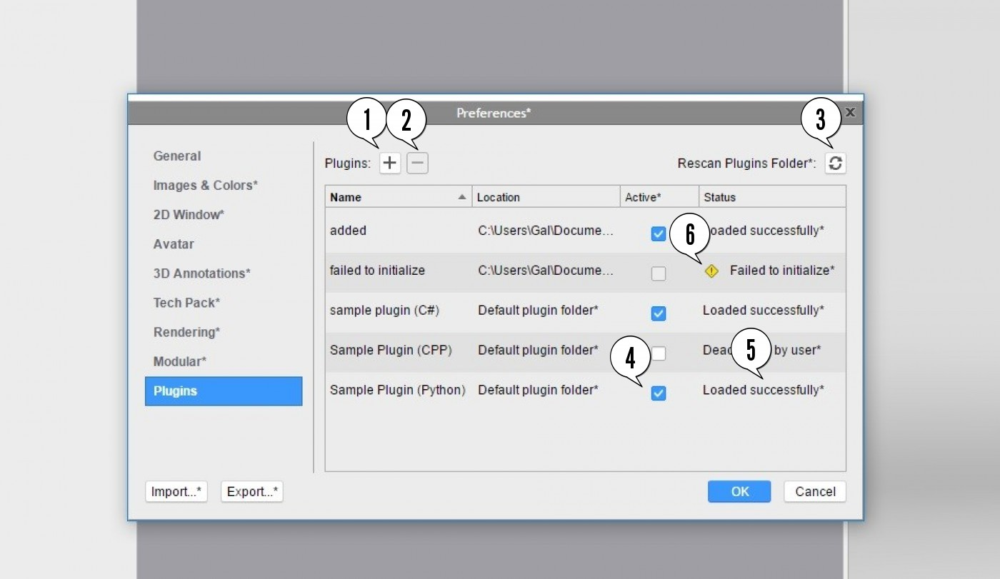
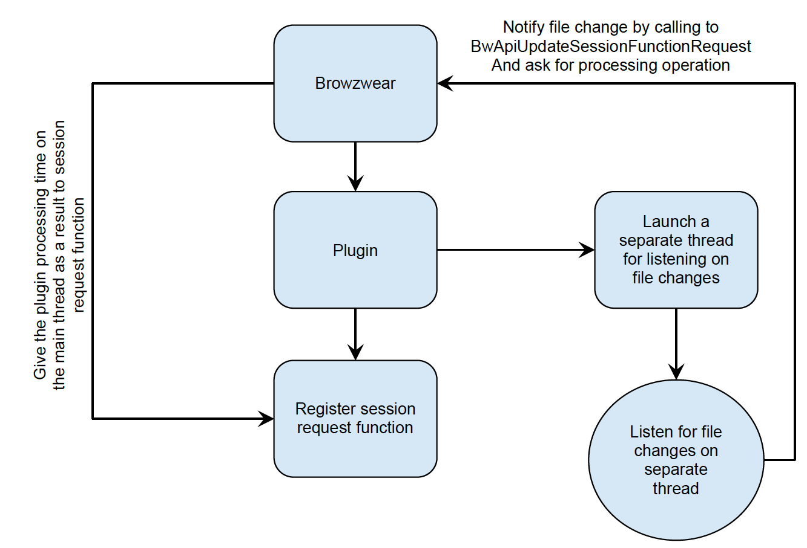

## Sample plugin

## Add menu item to the Plugins menu

You can add menu items to your plugin in order to run operations in VStitcher. </br>
Note: You will see your menu item under "Plugins" if at least one menu item exists.

<!--DOCUSAURUS_CODE_TABS-->

<!--Python-->
```python
class Callback(BwApi.CallbackBase):
  def Run(self, garmentId, callbackId, dataString):
      if (callbackId == 1):
          #do more stuff here...
      return 0

def BwApiPluginInit():
  BwApi.MenuFunctionAdd('Function name', callback, 1)
  return 1;

callback = Callback()
```

<!--C++-->
```cpp
int BW_PLUGIN_EXPORT BwApiPluginInit()
{
  int funcId = 0;
  BwApiMenuFunctionAdd("Function name", &_menuCallback, 1);
  return 1;
}

class CMenuCallback : public BwApiCallbackBase
{
public:
  virtual int Run(const char* garmentId, long callbackId, const char* dataString)
  {
    //do more stuff here...
  }
};
```
<!--C#-->
```csharp
using BwPluginApi;

class BwApiPlugin
{
  public static int Init(string args)
  {
    BwApi.MenuFunctionAdd("Function name", SamplePluginCallback.callBack, 1);

    return 1;
  }
}

class SamplePluginCallback : CallbackBase
{
  public override int Run(string GarmentId, int callbackId, string dataString)
  {
    if(callbackId == 1)
    {
      //do more stuff here...
    }
    return 0;
  }
  public static SamplePluginCallback callback = new SamplePluginCallback();
}

```

<!--END_DOCUSAURUS_CODE_TABS-->

## Versioning
  Important: The latest API version is 3 </br>
  To support backward compatability if the 'api_version' field is not exist on the plugin.json then version 1 will be used. </br>
  In order to be able to use the latest API schemas and functions please add the 'api_version' with the right value </br>
  For example:
```json
 	{
  "identifier": "com.browzwear.sample",
  "name": "Sample plugin",
  "api_version": 3,
  "type": "python",
  "main": "src",
  "version": "1.0.1"
 	}
```

## Plugin Manager in VStitcher
The Plugin Manager allows you to manage all of the plugins that are connected to Browzwear.

To view the Plugin Manager open VStitcher/Lotta -> Preferences -> Plugins.


1. Add plugin: The plus button allow you add a custom plugin. To add a plugin, select a folder with plugin.json file.
2. Remove plugin: The minus button allows you to remove a custom plugin. This option is multi select: you may select more than one item to remove as long all the items are removable. (You cannot remove a plugin from a default folder.)
3. Rescan plugins: Search for new plugins in the default folders or remove disabled or non-existing default plugins.
4. Activate/Deactivate: Disable/Enable a plugin. After you Check/Uncheck a plugin, press the OK button to invoke the operation.
5. Status: Shows the current status of a plugin.
6. Reload: Upon failure, the reload button appears: the yellow diamond with exclamation mark. You may attempt to fix the problem and try again to load the plugin.

## Creating an external html window

## Register to system events
You can register your plugin to be notified when certain system events happen. <br/>
The support events are: POST_INTIALIZE (Browzwear UI is ready), GARMENT_OPEN, GARMENT_NEW, GARMENT_SAVED, GARMENT_CLOSED, and GARMENT_MODIFIED.

<!--DOCUSAURUS_CODE_TABS-->

<!--Python-->
```python
class EventCallback(BwApi.CallbackBase):
  def Run(self, garmentId, callbackId, dataString):
    # callback for garment saved event
    if (callbackId == 1){
      # do some stuff here
    }
    return 1;

callback = EventCallback()

def BwApiPluginInit():
  funcId = BwApi.EventRegister(callback, 1, BwApi.BW_API_EVENT_GARMENT_SAVED);
  return 1;
```
<!--C++-->
```cpp
class CEventCallback : public BwApiCallbackBase
{
  public:
    virtual int Run(const char* garmentId, long callbackId, const char* dataString);
    {
      // callback for garment saved event
      if (callbackId == 1){
        // do some stuff here
      }
      return 1;
    }
};

CEventCallback callback;

BW_PLUGIN_EXPORT int WINAPI BwApiPluginInit()
{
  int funcId = 0;
  BwApiEventRegister(&callback, 1, BW_API_EVENT_GARMENT_SAVED, &funcId);
  return 1;
}
```
<!--C#-->
```csharp
using BwPluginApi;
class EventCallback : CallbackBase
{
  public override int Run(string garmentId, int callbackId, string dataString)
  {
    // callback for garment saved event
    if (callbackId == 1){
      // do some stuff here
    }
  }
}

public static EventCallback callback = new EventCallback();

class BwApiPlugin
{
  public static int Init(string args)
  {
    int funcId = 0;
    BwApi.EventRegister(callback, 1, EventType.BW_API_EVENT_GARMENT_SAVED, out funcId);
    return 1;
  }
}
```
<!--END_DOCUSAURUS_CODE_TABS-->


## Multithreaded plugin

All API calls should be invoked from main thread only, if your plugin is a multithreaded plugin you can ask Browzwear to perform an operation. 

For example, you can create your own thread that listens to file changes and when that file changes you can ask Browzwear to perform the plugin operation.

Browzwear will call your plugin during the next idle. The operation itself must be on the main thread, but the request for plugin processing time can be called from a separate thread. <br/>

<!--DOCUSAURUS_CODE_TABS-->

<!--Python-->
```python
import BwApi
import threading

class SessionCallback(BwApi.CallbackBase):
    def Run(self, garmentId, callbackId, dataString):
        if (callbackId == 0):
            print('Call SessionCallback.Run with 0 callbackId from {}'.format(dataString))

        return 0

def Func0():
    BwApi.UpdateSessionFunctionRequest_v2('com.browzwear.sampleplugin', 0, "Func0")

def BwApiPluginInit():
    BwApi.UpdateSessionFunctionSet_v2(sessionCallback)

    t0 = threading.Thread(target=Func0)
    t0.start()

    return 1;


sessionCallback = SessionCallback()
```
<!--C++-->
```cpp

class CSessionCallback : public BwApiCallbackBase
{
public:
		int Run(const char* garmentId, long callbackId, const char* dataString)
		{
			switch (callbackId)
			{
			case 0:
					return 0;
			}

			return -1;
		}
};

CSessionCallback _sessionCallback;

void threadFunc()
{
		BwApiUpdateSessionFunctionRequest_v2("com.browzwear.sampleplugin", 0, "some data");
}

int BW_PLUGIN_EXPORT BwApiPluginInit()
{
		BwApiUpdateSessionFunctionSet_v2(&_sessionCallback);
		std::thread t(threadFunc);
		t.detach();

		return 1;
}
```
<!--END_DOCUSAURUS_CODE_TABS-->

Note: Only one thread can have a request applied. So, if you have more than one thread which calls UpdateSessionFunctionRequest_v2, and the error is equal to -2, it means that another thread is using a request process.

You may try again when the other thread is finished.